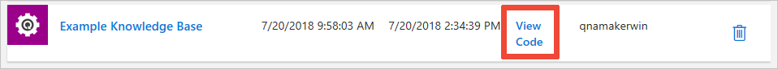

# Cognitive Services QnA Maker Samples in C#

These REST samples show you how to programmatically create, update, publish, and replace a QnA Maker knowledge base, amongst many other ways to interact with it. All samples are in C#. To view these same samples in other languages:

[cognitive-services-qnamaker-java](https://github.com/Azure-Samples/cognitive-services-qnamaker-java)

[cognitive-services-qnamaker-nodejs](https://github.com/Azure-Samples/cognitive-services-qnamaker-nodejs)

[cognitive-services-qnamaker-python](https://github.com/Azure-Samples/cognitive-services-qnamaker-python)

## Features

Included are the following samples:

* [Create knowledge base](create-knowledge-base.cs). Create a brand new knowledge base with given FAQ URLs. 
* [Update knowledge base](update-knowledge-base.cs). Update an existing knowledge base by changing its name.
* [Publish knowledge base](publish-knowledge-base.cs). Publish any existing knowledge base to the host your Azure account.
* [Replace knowledge base](replace-knowledge-base.cs). Replace an entire existing knowledge base with a custom question/answer pair.
* [Download knowledge base](download-knowledge-base.cs). Download the contents of your existing knowledge base in JSON.
* [Delete knowledge base](delete-knowledge-base.cs). Deletes an existing knowledge base.

All REST samples revolve around what you can do with a knowledge base, which is made up of FAQs or product manuals where there is a question and an answer. QnA Maker gives you more control over how to answer questions by allowing you to train a chat bot to give answers in a variety of ways that feels more like natural, conversational exchanges.

## Getting Started

### Prerequisites

For each sample, a subscription key is required from your Azure Portal account. 
* To create a new account/resource for QnA Maker, see [Create a Cognitive Services API account in the Azure portal](https://docs.microsoft.com/en-us/azure/cognitive-services/cognitive-services-apis-create-account). You may need to 'Search in Marketplace' for QnA Maker if you don't see it in the list given.  
* For existing accounts, the key can be found in your [Azure Portal](https://ms.portal.azure.com/) dashboard in your QnA Maker resource under Resource Management > Keys. You'll need this key to add to your sample before running.

With the exception of creating a new knowledge base, these samples will require your [QnA Maker account](https://www.qnamaker.ai/Home/MyServices) knowledge base ID. To find your knowledge base ID, go to [My knowledge bases](https://www.qnamaker.ai/Home/MyServices) and select `View Code` on the right. You'll see the http request and your knowledge base ID is in the topmost line: for example, `POST /knowledgebases/2700e6b9-91a1-41e9-a958-6d1a98735b10/...`. Use only the ID.

### Run sample

1. Create a C# Console App (.NET Framework) in Visual Studio 2017, then add the sample you want to try to Program.cs. For example, if you want to try create-new-knowledge-base.cs. Copy/paste the code from there into your Program.cs.

1. You can either create one console app per sample, or add a bunch of samples to one console app as projects, then run them separately.

1. Install the Newtonsoft.Json NuGet package.

1. Read the comments in the code sample to see where you add your keys.

1. Run the sample.

### Quickstart

* Quickstart: [Create a new knowledge base in C#](create-knowledge-base.cs)
* Quickstart: [Update a knowledge base in C#](update-knowledge-base.cs)
* Quickstart: [Publish a knowledge base in C#](publish-knowledge-base.cs)
* More quickstarts coming soon... in the meantime, refer to [Quickstart for Microsoft QnA Maker API with C#](https://docs.microsoft.com/en-us/azure/cognitive-services/qnamaker/quickstarts/csharp) for all quickstarts in minimal format.

### Web app bot

* How-to: [Integrate LUIS with QnA Maker with Web app bot 3.x](documentation-samples/bot-luis-qnamaker/readme.md)

## References

[QnA Maker V4.0](https://westus.dev.cognitive.microsoft.com/docs/services/5a93fcf85b4ccd136866eb37/operations/5ac266295b4ccd1554da75ff)
